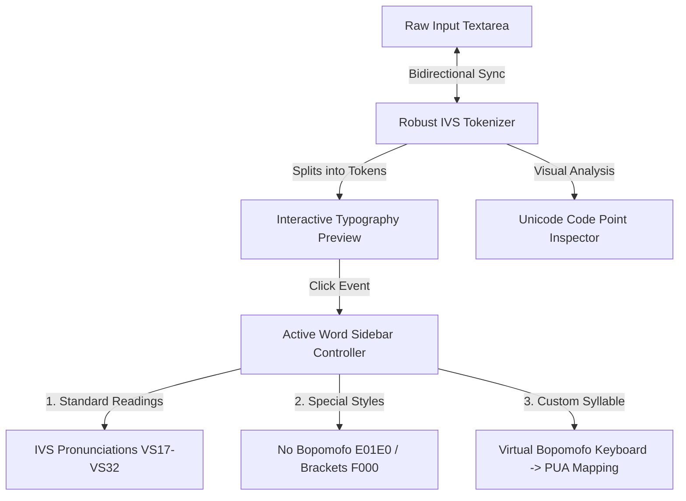

# Bopomofo Unicode IVS Font Explorer — Walkthrough

Welcome to the **Bopomofo IVS Typeface Explorer**! This walkthrough explains how the dynamic, interactive dashboard operates and explores the core Unicode mechanics behind Bopomofo IVS (Ideographic Variation Sequence) typography.

---

## 🚀 Key Features Built

We have created a production-grade, highly-aesthetic developer dashboard structured cleanly in:
*   [index.html](file:///Users/softmobile/Documents/Git/GitHub/joshlee-softmobile/BoPoMoWebPage/demo/ivs1/index.html) (Markup structure)
*   [style.css](file:///Users/softmobile/Documents/Git/GitHub/joshlee-softmobile/BoPoMoWebPage/demo/ivs1/style.css) (Curated dark mode style sheets)
*   [script.js](file:///Users/softmobile/Documents/Git/GitHub/joshlee-softmobile/BoPoMoWebPage/demo/ivs1/script.js) (Unicode parsing and UI logic)
*   [poyin_db.js](file:///Users/softmobile/Documents/Git/GitHub/joshlee-softmobile/BoPoMoWebPage/demo/ivs1/poyin_db.js) (Local database mapping 1,300+ syllables)



### 1. Dynamic On-the-Fly Font Loader
The dashboard dynamically loads and registers the heavy TTF files directly from the local directory `demo/font/` using the modern JavaScript **CSS Font Loading API**:
- **粉圓注音 (Bpmf Huninn)**: Rounded, cute, soft. (4.8 MB)
- **芫荽注音 (Bpmf Iansui)**: Clean, organic, handwriting-like (based on Klee). (7.7 MB)
- **字嗨注音標楷 (BpmfZihiKaiStd)**: Formal, textbook-style Calligraphy. (17.5 MB)

When a font is selected, a sleek, neon glassmorphic spinner locks the interface, showing loaded state and file size, and registers the font in hardware in milliseconds once fetched.

### 2. Dual-Pane Interactive Playground
- **Left Column**: Interactive input textarea equipped with three beautiful presets (Polyphonic Showcase, Textbook Card, Classical Poem).
- **Right Column**: Live Typography Viewer, displaying rendered Bopomofo side-annotations.
- When any character is clicked, a subtle glow highlights the token in the workspace and inspector, and focuses the **Sidebar Controller** on it.

### 3. Sidebar Controller & Syllable Assembler
When active, the sidebar provides total control over the Bopomofo annotations:
- **Standard Readings**: Renders a list of standard readings found in the dictionary, displaying how the font renders each variant in real time. Clicking a reading instantly updates the main character with the specific variation selector code (e.g. `VS18`, `VS19`).
- **Special Layout Styles**:
  - **注音留白 (No Bopomofo)**: Hides the Bopomofo, leaving only the base Chinese character (injects `U+E01E0`).
  - **注音填空 (Empty Brackets)**: Renders the base character with empty brackets, perfect for creating children's textbook worksheets (injects `U+E01E0` + `U+F000`).
- **Custom Bopomofo Assembler**: A sleek virtual keyboard displaying Consonants, Medials, Vowels, and Tones. Keypresses validate syllable structures on the fly:
  $$\text{Syllable} = \text{Initials}^? + \text{Medials}^? + \text{Vowels}^? + \text{Tones}^?$$
  It dynamically searches the 1,300+ syllable dictionary and maps the assembled spelling to its corresponding Private Use Area (PUA) code point starting at `0xF001`.

### 4. Under-the-Hood Unicode Inspector
Displays the memory stream of characters, showcasing how the typography separates text data from visual guide rendering:
- Hovering over a card highlights the word in the editor workspace.
- Each card details:
  - **字元 (Base Unicode)**: e.g. `和` (`U+548C`)
  - **IVS (Variation Selector)**: e.g. `VS228` (`U+E01E2`)
  - **PUA (Private Use Area)**: e.g. `U+F195` (Custom Syllable mapping)

---

## 🛠️ The Core IVS Parsing Engine

Unlike standard split strings which break UTF-16 surrogate pairs (e.g. `U+E0100` represented as high surrogate `\udb40` and low surrogate `\uddxx`), our dynamic tokenizer uses standard modern ES6 spreads `[...string]` and codePointAt validations:

```javascript
function parseIVSText(rawText) {
    const chars = [...rawText];
    const tokens = [];
    
    for (let i = 0; i < chars.length; i++) {
        let char = chars[i];
        let token = char;
        
        // 1. Check if followed by IVS Selector (U+E0100 - U+E01EF)
        if (i + 1 < chars.length) {
            let nextCode = chars[i + 1].codePointAt(0);
            if (nextCode >= 0xE0100 && nextCode <= 0xE01EF) {
                token += chars[i + 1];
                i++;
                
                // 2. Check if U+E01E0 is followed by a PUA custom ruby character (U+F000 - U+F8FF)
                if (nextCode === 0xE01E0 && i + 1 < chars.length) {
                    let nextNextCode = chars[i + 1].codePointAt(0);
                    if (nextNextCode >= 0xF000 && nextNextCode <= 0xF8FF) {
                        token += chars[i + 1];
                        i++;
                    }
                }
            }
        }
        tokens.push(token);
    }
    return tokens;
}
```

This ensures that:
1. Standard single characters stay singular.
2. Character + variation selector (e.g. `和\uE01E2`) are merged as one visual token.
3. Character + `U+E01E0` + custom syllable (e.g. `和\uE01E0\uF195`) are correctly grouped as one visual token.

---

## 💡 How to Run & Explore

1. Since the project uses local font files `demo/font/*.ttf`, local style [style.css](file:///Users/softmobile/Documents/Git/GitHub/joshlee-softmobile/BoPoMoWebPage/demo/ivs1/style.css), local logic [script.js](file:///Users/softmobile/Documents/Git/GitHub/joshlee-softmobile/BoPoMoWebPage/demo/ivs1/script.js), and local database [poyin_db.js](file:///Users/softmobile/Documents/Git/GitHub/joshlee-softmobile/BoPoMoWebPage/demo/ivs1/poyin_db.js), double-click to open [index.html](file:///Users/softmobile/Documents/Git/GitHub/joshlee-softmobile/BoPoMoWebPage/demo/ivs1/index.html) in any modern web browser (Safari, Chrome, Firefox, Edge).
2. Load any preset sentence or write your own text in the left pane.
3. Switch between **注音粉圓**, **注音芫荽**, and **字嗨標楷** to see the glyph layout transform on the fly!
4. Select a word like `和` in the Live render area and witness how the sidebar automatically recognizes its six pronunciation variants, or build custom spellings using the virtual keyboard!
